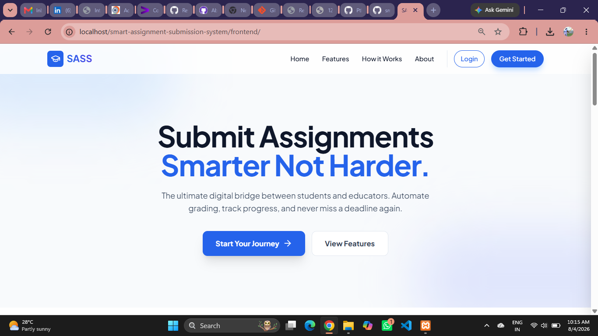

# 📚 Smart Assignment Submission System

A web-based application that simplifies assignment submission and management for educational institutions. Students can securely upload assignments, while teachers can create, manage, and review assignments through an intuitive dashboard.

---

## 🚀 Features

- 🔐 Secure Login & Authentication
- 👨‍🎓 Student Dashboard
- 👨‍🏫 Teacher Dashboard
- 📤 Upload Assignments
- 📂 View Submitted Assignments
- 📝 Manage Assignments
- 📅 Assignment Deadline Management
- 📊 Assignment Status Tracking
- 💻 Responsive User Interface

---

## 🛠️ Tech Stack

- **Frontend:** HTML, CSS, JavaScript
- **Backend:** PHP
- **Database:** MySQL
- **Server:** XAMPP (Apache)

---

## 📂 Project Structure

```
smart-assignment-submission-system/
│── backend/
│── frontend/
│── database/
│── screenshots/
│── README.md
```

---

## ⚙️ Installation

1. Clone the repository

```bash
git clone https://github.com/Ptlmohit/smart-assignment-submission-system.git
```

2. Move the project folder to

```
C:\xampp\htdocs\
```

3. Start **Apache** and **MySQL** from XAMPP.

4. Import the database

```
database/sass_db.sql
```

5. Open your browser

```
http://localhost/smart-assignment-submission-system/
```

---

# 📸 Screenshots

## 🏠 Home Page



---

## 👨‍🎓 Student Dashboard


---

## 👨‍🏫 Teacher Dashboard


---

## 📤 Upload Assignment


---

## 📂 Student Assignments


---

## 📝 Manage Assignment


---

## 👀 View Submission


---

## 🔮 Future Enhancements

- Email Notifications
- Assignment Grading
- Faculty Feedback
- Plagiarism Detection
- Cloud Storage Integration
- Role-Based Access Control

---

## 👨‍💻 Author

**Mohit Patel**

GitHub: https://github.com/Ptlmohit

---

⭐ If you found this project helpful, please give it a **Star**.
